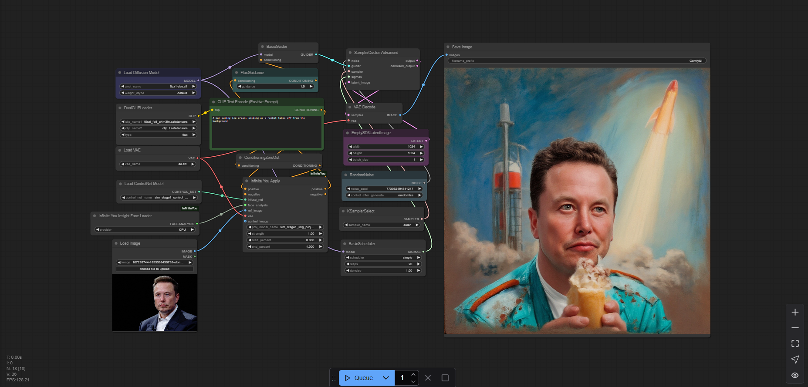
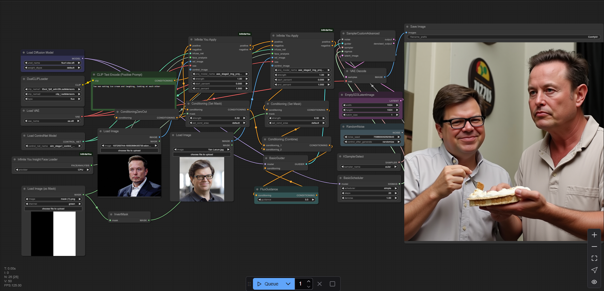

# ComfyUI Infinite You Node

Implementation of <a href="https://bytedance.github.io/InfiniteYou">ByteDance Infinite You</a> in ComfyUI. Supports multiple faces, stacking controlNets, gaze control, pre-processor for face gaze.

You can find the official paper and code here - <a href="https://bytedance.github.io/InfiniteYou">Infinite You</a>

## Installation

First clone the repo

```shell
    cd custom_nodes
    git clone https://github.com/katalist-ai/ComfyUI-InfiniteYou.git
    cd ComfyUI-InfiniteYou
    pip install -r requirements.txt
```

There are two models - 

1. sim - focuses more on preserving facial similarity.
2. aes - focuses on aesthetical quality, composition as well.

Then download the relevant models and place it in the appropriate folders

- Download the control net models to `\models\checkpoints\`
    - [Similarity model (control net)](https://huggingface.co/vuongminhkhoi4/ComfyUI_InfiniteYou/resolve/main/sim_stage1_control_net/sim_stage1_control_net.safetensors)
    - [Aesthetics Model (control net)](https://huggingface.co/vuongminhkhoi4/ComfyUI_InfiniteYou/resolve/main/aes_stage2_control_net/aes_stage2_control.safetensors)

- Download the image projection model to `\models\inf-you\`
    - [Similarity model (image projection)](https://huggingface.co/vuongminhkhoi4/ComfyUI_InfiniteYou/resolve/main/sim_stage1_control_net/sim_stage1_img_proj.bin)
    - [Aesthetics Model (image projection)](https://huggingface.co/vuongminhkhoi4/ComfyUI_InfiniteYou/resolve/main/aes_stage2_control_net/aes_stage2_img_proj.bin)

- InsightFace model will be auto-downloaded

## Examples

1. Infinite you workflow for single person identity preservation. This works really well with ability to do different styles and so far the most flexible identity preserving research.

<!-- Show examples/nfinite_you.png -->



[Workflow](https://github.com/katalist-ai/ComfyUI-InfiniteYou/blob/main/workflows/infinite_you.json)

2. Infinite you workflow with gaze control. This model also takes a control image that can be used to control gaze. This implementation includes a pre-processor to generate the control image from a image.

<!-- Show examples/infinite_you_gaze.png -->


[Workflow](https://github.com/katalist-ai/ComfyUI-InfiniteYou/blob/main/workflows/gaze_control.json)

3. Infinite you workflow with gaze control and multiple faces. This is still experimental, only way to get it working is using aes projection weights with sim infuse net weights.

<!-- Show examples/infinite_you_gaze_multiple.png -->



[Workflow](https://github.com/katalist-ai/ComfyUI-InfiniteYou/blob/main/workflows/two_characters.json)

## Credits & Acknowledgement 

This work was possible due to the open release of InfiniteYou and the strong ComfyUI community. Model weights come under creative commons license user under your own discretion.

Special thanks to:

- <a href="https://bytedance.github.io/InfiniteYou">ByteDance Infinite You</a> team for thsi amazing work. 
- <a href="https://github.com/ZenAI-Vietnam/ComfyUI_InfiniteYou/tree/main">Zen AI</a> Team for uploading the weights and early implementation.